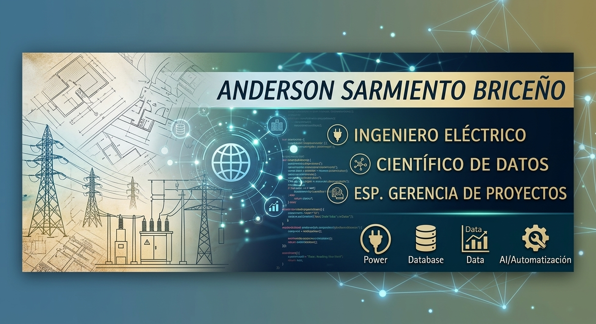

<p align="center">

</p>
<div align="center">
⚡ Anderson Sarmiento Briceño
Ingeniero Eléctrico | Científico de Datos | Esp. Gerencia de Proyectos
Data Science · Machine Learning · Data Engineering · Full-Stack Python · Business Intelligence
<br>


</div>
<br>
👨‍💻 Sobre mí
Soy Ingeniero Eléctrico con más de 13 años de experiencia en infraestructura y redes MT/BT, especializado en Gerencia de Proyectos y Ciencia de Datos. Aplico Machine Learning, desarrollo web en Python, analítica avanzada e ingeniería de datos a la movilidad eléctrica, la eficiencia energética y la optimización operacional.
Transformo grandes volúmenes de información técnica, operacionales y de telemetría en aplicaciones robustas, procesos automatizados y modelos predictivos de alto impacto.
> [!TIP]
> 💡 **Fórmula de valor:** *Ingeniería Eléctrica + Data Science + Software & IA = Soluciones eficientes y decisiones basadas en datos.*
<br>
🚀 Proyectos Destacados y Portafolio
<table>
<tr>
<td width="100%" valign="top" colspan="2">
🚍 Comparador de Rutas de Transporte Urbano   
Aplicación web de análisis geoespacial para planeación de transporte. Mide cuánto se superponen las rutas de transporte urbano entre sí y frente a los proyectos de infraestructura de la ciudad (metro, tren regional y nuevas troncales), y muestra en qué tramo del recorrido suben los pasajeros.
`Python` `Streamlit` `GeoPandas` `Shapely` `Folium` `Plotly` `Pandas` `PyArrow` `GeoJSON` `OpenStreetMap`
<a href="https://comparador-rutas-vj8yq4mjrew7ujxoykq7nd.streamlit.app/"></a>
<a href="https://github.com/anderson-sarmiento-briceno/comparador-rutas"></a>
</td>
</tr>
<tr>
<td width="50%" valign="top">
🏗️ Framework ETL Prototipo - Data Warehouse
Arquitectura modular de pipelines ETL para transporte masivo y flotas. Ingesta desde heterogéneas fuentes (CMMS, ERP, Telemetría, APIs, Web Scraping), modelado dimensional en estrella, almacenamiento en Delta Lake y notificaciones automatizadas.
`Python` `R` `Delta Lake` `DuckDB` `PostgreSQL` `Polars` `SQLAlchemy` `ETL`
<a href="https://github.com/anderson-sarmiento-briceno/etl-dw-prototype"></a>
</td>
<td width="50%" valign="top">
🔋 Estado de Salud de Baterías (SOH)
Análisis completo de Ciencia de Datos sobre los factores que afectan el SOH de baterías en buses eléctricos. Limpieza de 172k+ registros, feature engineering, modelo XGBoost + SHAP y recomendaciones de mantenimiento predictivo.
`Python` `Pandas` `NumPy` `XGBoost` `SHAP` `Scikit-learn` `Matplotlib` `Seaborn` `Jupyter`
<a href="https://github.com/anderson-sarmiento-briceno/SOH"></a>
</td>
</tr>
<tr>
<td width="50%" valign="top">
📍 Consumo en Reposo (Velocidad 0) – Geocercas PIR | ISO 50001
Pipeline de ETL de alto rendimiento y generación automatizada de informes ejecutivos en PDF para el diagnóstico de desperdicio energético en reposo dentro de geocercas KML.
`Python` `Polars` `ReportLab` `Matplotlib` `Seaborn` `KML` `Parquet` `ETL`
<a href="https://github.com/anderson-sarmiento-briceno/informe-consumo-reposo-pir-iso50001"></a>
</td>
<td width="50%" valign="top">
🏥 Gestión Salud V2 - Greenmovil
Sistema web profesional para el control, seguimiento e importación masiva (+3,800 registros) de historias clínicas y diagnósticos DX del personal.
`Python 3.11+` `Django 4.x` `SQLite` `HTML5` `CSS3` `Git`
<a href="https://github.com/andersonsarmientoBI/gestion_salud_v2"></a>
</td>
</tr>
<tr>
<td width="50%" valign="top">
🤖 Constructor CV (Agente de IA)
Aplicación local en Python que automatiza y adapta hojas de vida en PDF a ofertas laborales específicas utilizando modelos LLM.
`Python` `Ollama` `Llama 3` `ReportLab` `JSON` `IA Generativa`
<a href="https://github.com/anderson-sarmiento-briceno/constructor-CV"></a>
</td>
<td width="50%" valign="top">
⚡ Línea Base Energética - Autobuses Eléctricos (ISO 50001)
Construcción de la Línea Base Energética (LBEN) para flota de autobuses eléctricos. Modelos de regresión lineal, definición de metas de ahorro y análisis conforme a ISO 50001.
`Python` `Pandas` `Scikit-learn` `PostgreSQL` `Matplotlib` `Seaborn` `Jupyter`
<a href="https://github.com/anderson-sarmiento-briceno/lben-buses-electricos-iso50001"></a>
</td>
</tr>
<tr>
<td width="100%" valign="top" colspan="2">
📂 Mi Portafolio Principal (Data Science & ML)
Colección de cuadernos Jupyter con análisis exploratorio de datos (EDA), modelos predictivos, análisis financiero (FOREX) y apuestas deportivas.
`Python` `Scikit-Learn` `Pandas` `Jupyter` `Machine Learning`
<a href="https://github.com/anderson-sarmiento-briceno/mi-portafolio"></a>
</td>
</tr>
</table>
<br>
📈 Impacto Promedio en Resultados
Área	Métricas e Impacto Clave
🏗️ Ingeniería de Datos & Data Warehouse	Diseño y construcción de pipelines ETL integrando +50 flujos heterogéneos en Delta Lake
⚡ Telemetría & Eficiencia Energética	Pipeline ETL automatizado con Polars/ReportLab para detección de consumo ineficiente (ISO 50001)
🔋 Salud de Baterías (SOH)	Identificación de umbrales críticos de caída semanal del SOH y drivers de degradación
🏥 Sistemas Web & Datos	+3,800 registros procesados e importados masivamente para gestión clínica en Django
🚌 Optimización Operacional	-80% tiempo en informes de consumo · +28% precisión en proyecciones energéticas
🛡️ Seguridad en Obras (HSEQ)	-40% accidentes mediante modelos predictivos de riesgo en redes eléctricas
🚨 Monitoreo & Diagnóstico	-55% tiempo en detección de anomalías eléctricas (armónicos) con Python + AWS
💬 Automatización & IA	+35% conversión en ventas con Chatbots · -70% tiempo en integración de datos
📊 Trading & Algoritmos	82% de precisión en señales de trading mediante árboles de regresión (MetaTrader 5)
<br>
🛠️ Stack Tecnológico
<table>
<tr>
<td width="25%" valign="top"><b>🏗️ Data Engineering & ETL</b></td>
<td width="75%">


</td>
</tr>
<tr>
<td width="25%" valign="top"><b>🗺️ Geoespacial & Mapas</b></td>
<td width="75%">


</td>
</tr>
<tr>
<td width="25%" valign="top"><b>🌐 Backend & Web Dev</b></td>
<td width="75%">


</td>
</tr>
<tr>
<td width="25%" valign="top"><b>🧠 Data Science & IA</b></td>
<td width="75%">


</td>
</tr>
<tr>
<td width="25%" valign="top"><b>📊 Business Intelligence & Tools</b></td>
<td width="75%">


</td>
</tr>
<tr>
<td width="25%" valign="top"><b>⚡ Ingeniería Eléctrica</b></td>
<td width="75%">


</td>
</tr>
</table>
<br>
💼 Experiencia Relevante
```text
2025 - Presente | Científico de Datos & Desarrollador @ Green Movil
└─ Pipeline ETL de consumo en reposo (Polars/ReportLab), Gestión Salud V2 (Django), 
   análisis de SOH de baterías (XGBoost + SHAP) y telemetría ISO 50001.

2023 - 2025 | Científico de Datos & Automatización @ Consultor Freelance
└─ Agentes de IA, Chatbots (WhatsApp API), Trading Bots (MT5) y pipelines ETL.

2010 - 2023 | Profesional en Infraestructura y Redes @ Enel Colombia
└─ Liderazgo de +20 proyectos eléctricos MT/BT, analítica HSEQ y modelos de riesgo.
```
<br>
<div align="center">


</div>
